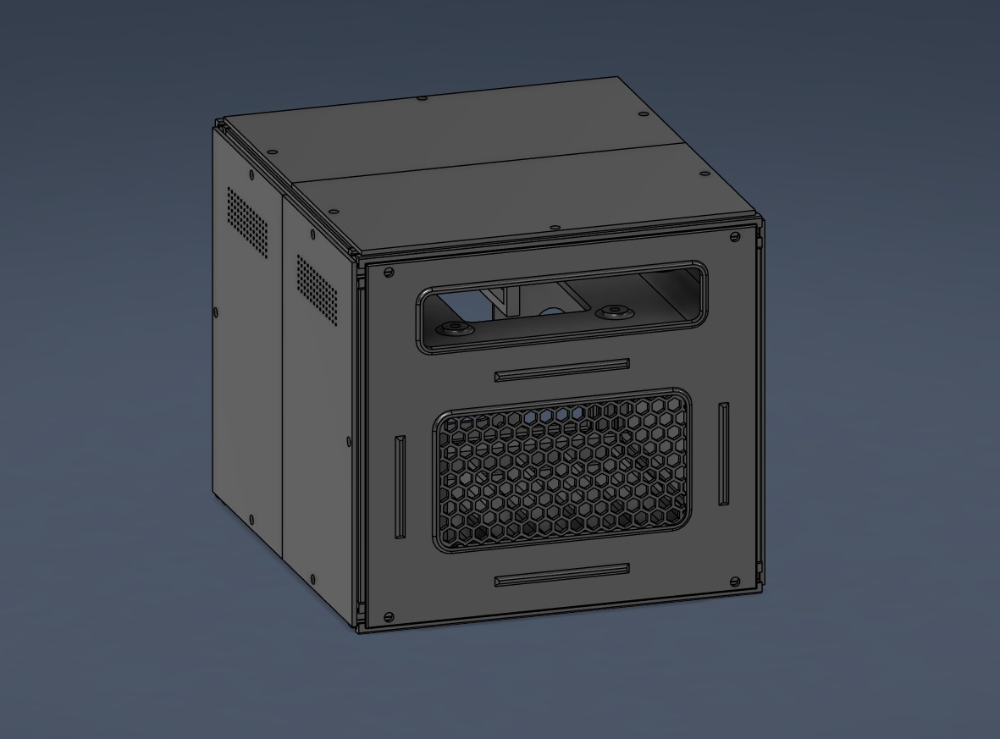

# Affordable 6-Bay DIY NAS Build

## Overview

This project documents my custom 6-bay NAS designed to provide a competitive alternative to off-the-shelf NAS solutions such as Synology and QNAP, while maintaining a compact and aesthetically clean form factor.

This build is intended for makers and builders who prefer an open, customizable NAS platform with greater flexibility and expandability than typical prebuilt solutions.

---

## Design Summary

- 2020 aluminum extrusion enclosure  
- Custom 6-bay hard drive dock using standard 3.5" HDD mounting dimensions  
- 3D-printed mounting brackets and structural supports  
- Reinforced design for long-term durability  
- VESA mounting support for flexible placement  

This NAS is not intended to compete with enterprise-grade systems. Instead, it provides a powerful, budget-conscious alternative to consumer NAS products, offering increased compute capability, storage flexibility, and electrical headroom.

---

## Project Status

**Status:** In Development

This documentation contains the necessary information to complete the build. However, refinements and expanded documentation are still in progress. Please consider this if beginning the project prior to the final release.

---

## Hardware Requirements

### Structural Components

- 90-degree 2020 extrusion corner brackets *(optional but recommended for added rigidity)*  
- M5 T-slot nuts  
- M5 screws  
- M3 socket head screws  
- M3 heat-set inserts  
- M2 socket head screw (1x)  
- M2 heat-set insert (1x)  
- PETG filament  

### 2020 Aluminum Extrusion Lengths  
*(You may round down slightly — the printed components are designed to fit snug.)*

- 4 × 196.5 mm  
- 4 × 252.5 mm  
- 4 × 236.5 mm  
- 2 × 212.5 mm  

A quality electronic screwdriver kit with interchangeable bits is strongly recommended for assembly. I can't recommend [this](https://amzn.to/3ZBrws1) one enough :)

---

## Electronics Requirements

- Mini PC with exposed PCIe lanes **or** NVMe (M.2) support  
- Flex ATX power supply rated appropriately for your drive count  
- 6× SATA data cables  
- 1× On/Off rocker switch  

---

## Electronics Configuration

Your mini PC must support either:
- A native PCIe slot with an HBA card, or  
- NVMe over M.2 (recommended)

For this build, I used an HP G405 G4 mini PC purchased for approximately $100 on eBay. It includes:

- A dedicated SSD slot for the boot drive  
- One NVMe M.2 slot  

> **Important:** Your operating system must be installed on a separate drive. Do not use one of the six HDDs as your boot drive.

Using the NVMe slot allows for an M.2-to-6×SATA controller, enabling the system to read six independent drives while utilizing the full bandwidth of the NVMe interface. An M.2 extension cable was used to relocate the controller externally for cleaner routing.

---

## Power Supply Considerations

The included PSU mounting bracket is designed around standard Flex ATX dimensions. While it should fit most Flex PSUs, fitment is only guaranteed for the specific model used in this build. You can find it [here](https://amzn.to/4tF5a6t) or use the cheaper, modular version found [here](https://amzn.to/3OMDP2c)!

Because mechanical HDDs draw significant amperage during spin-up, especially when multiple drives start simultaneously, a high-quality and properly rated power supply is critical.

Do **not** underspec your PSU. This system is intended to run 24/7, and power reliability is essential for both safety and longevity.

Additional power calculations and recommendations will be added in future revisions.

---

## Power Switch Wiring

The rocker switch functions by bridging the appropriate two wires on the 20-pin ATX connector to control PSU power.

The mini PC retains its own independent power input and onboard power button.

If you are not comfortable modifying ATX wiring, prebuilt 20-pin jumper switches with integrated power buttons are widely available online. [Here](https://amzn.to/4kGWvN0) is an example of a good pick. 

---

## Future Documentation

This project is actively being developed. Planned additions include:

- A full in-depth build log  
- Long-form build breakdown and design decisions (YouTube)  
- Additional mounting bracket options for:
  - Lenovo ThinkCentre systems  
  - ZimaBoard  
  - Intel NUC  
  - Other common mini PCs  

I share ongoing progress and iterations on TikTok:
https://www.tiktok.com/@rmartin3d

YouTube channel:
https://www.youtube.com/@Rmartin3D

---

## Contact

For questions regarding fitment, configuration, or custom variations, please reach out through the Martin Studios website:

https://martinstudios.carrd.co/

---

**Created by Rmartin3D — Founder, Martin Studios**
